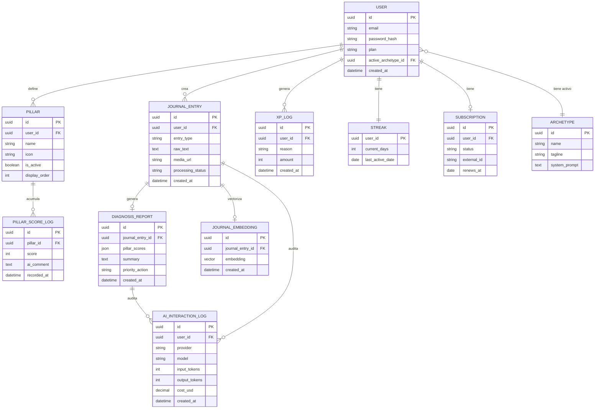
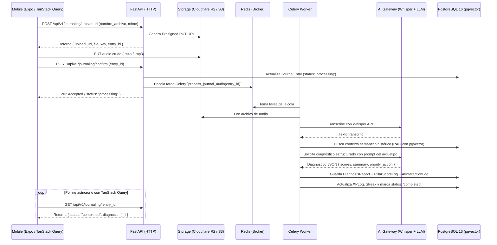
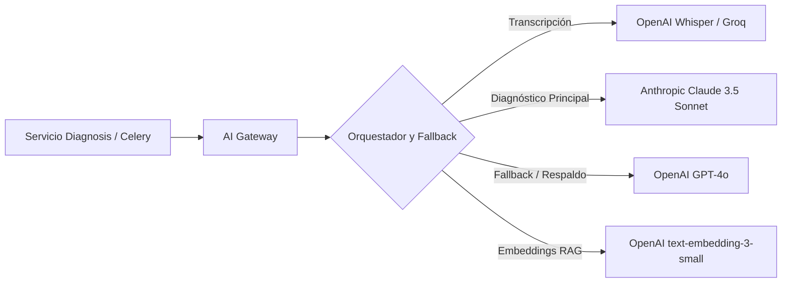

# NIKA — Especificación Técnica y Arquitectura de Arranque
### Documento Oficial para el Equipo de Desarrollo

**Alcance:** Stack tecnológico oficial, modelado de datos, backend (FastAPI + Celery), frontend/mobile unificado (React Native + Expo SDK + NativeWind), almacenamiento BLOB (R2/S3), orquestación de IA (OpenAI / Anthropic), DevOps y ciberseguridad.  
**No incluye:** Modelo de negocio, pricing ni propuesta de valor comercial (ver [nika_business_model.md](file:///home/jean/Desktop/UNI/Proyectos/nika-app/Context/nika_business_model.md)).

---

## Índice

1. [Stack Tecnológico Oficial](#1-stack-tecnológico-oficial)
2. [Modelado de Datos y Persistencia](#2-modelado-de-datos-y-persistencia)
3. [Arquitectura General y Flujo End-to-End](#3-arquitectura-general-y-flujo-end-to-end)
4. [Backend API y Procesamiento Asíncrono](#4-backend-api-y-procesamiento-asíncrono)
5. [Frontend y Mobile (React Native + Expo)](#5-frontend-y-mobile-react-native--expo)
6. [Almacenamiento BLOB y Manejo de Multimedia](#6-almacenamiento-blob-y-manejo-de-multimedia)
7. [Gateway de IA y Control de Costos](#7-gateway-de-ia-y-control-de-costos)
8. [DevOps y CI/CD](#8-devops-y-cicd)
9. [Ciberseguridad y Protección de Datos](#9-ciberseguridad-y-protección-de-datos)
10. [Checklist de Arranque Técnico](#10-checklist-de-arranque-técnico)

---

## 1. Stack Tecnológico Oficial

A continuación se detalla la selección oficial de tecnologías para la construcción del ecosistema NIKA, optimizada para rendimiento, escalabilidad y mínima duplicación de código:

| Capa / Componente | Tecnología Seleccionada | Justificación Técnica |
|---|---|---|
| **Frontend / Mobile** | **React Native + Expo SDK** (TypeScript) | Base de código única para Android, iOS y Web centrada. Cero código duplicado. |
| **Estilos UI** | **NativeWind** (Tailwind CSS) | Tokens consistentes de diseño oscuro con acentos naranja. |
| **Consumo de API** | **TanStack Query** (React Query) | Manejo de Server State, caché y polling asíncrono para reportes de IA. |
| **Backend API** | **FastAPI** (Python 3.11+) | Rendimiento asíncrono (ASGI), tipado estricto con Pydantic y documentación OpenAPI automática. |
| **Worker / Colas** | **Celery + Redis** | Procesamiento fuera del ciclo HTTP para transcripción de audio (Whisper) y llamadas a LLMs. |
| **Base de Datos** | **PostgreSQL 16 + pgvector** | Motor relacional ACID con soporte vectorial nativo para embeddings y búsqueda semántica (RAG). |
| **ORM / Migraciones** | **SQLAlchemy 2.0 + Alembic** | Mapeo relacional desacoplado y migraciones de esquema versionadas. |
| **Almacenamiento BLOB** | **Cloudflare R2 / AWS S3** | Almacenamiento seguro de archivos de audio crudo (`.m4a` / `.mp3`) mediante URLs prefirmadas. |
| **Gateway de IA** | **OpenAI SDK / Anthropic SDK** | Transcripción de audio e inferencia estructurada de diagnósticos con fallback y auditoría de tokens. |

---

## 2. Modelado de Datos y Persistencia

### 2.1 Entidades Principales

| Entidad | Descripción | Notas de diseño |
|---|---|---|
| `User` | Cuenta del usuario | Autenticación, plan (`free`/`pro`), ID de arquetipo activo |
| `Archetype` | Catálogo de arquetipos (Bio-Optimizer, The Cleaner, Novelty Engine, Psicólogo de Alto Rendimiento) | Tabla catálogo administrada; define el `system_prompt` base del mentor |
| `Pillar` | Pilar de vida del usuario (salud, finanzas, familia, rendimiento, etc.) | **Dinámico por usuario**: se inicializa con defaults pero son filas en BD editables por el usuario |
| `PillarScoreLog` | Histórico de puntuaciones por pilar en el tiempo | Serie temporal para alimentar gráficos de radar y análisis longitudinal |
| `JournalEntry` | Registro diario ("Espejo del día") | Soporta texto, audio o imagen. Guarda estado (`pending`, `completed`, `failed`) y URL en R2/S3 |
| `DiagnosisReport` | Análisis generado por la IA para una entrada | Separado de `JournalEntry` para permitir regeneraciones y auditoría |
| `JournalEmbedding` | Vector semántico de la entrada | Campo de tipo `vector(1536)` para RAG histórico del usuario vía `pgvector` |
| `XPLog` | Registro de eventos de experiencia | Histórico transaccional para calcular niveles y recompensar hábitos |
| `Streak` | Racha activa del usuario | Días consecutivos y fecha del último registro activo |
| `Subscription` | Estado de suscripción y pagos | Vinculación externa con pasarela de pago (Stripe / MercadoPago) |
| `AIInteractionLog` | Auditoría de cada llamada a modelos de IA | **Crítico**: modelo, proveedor, tokens de entrada/salida, latencia y costo en USD |

### 2.2 Diagrama Entidad-Relación



### 2.3 Decisiones de Persistencia (PostgreSQL 16 + SQLAlchemy 2.0 + Alembic)
- **Migraciones versionadas con Alembic**: Todo cambio en tablas o índices debe realizarse mediante migraciones versionadas (`alembic revision --autogenerate`), sin modificar tablas manualmente en producción.
- **Soporte vectorial con `pgvector`**: Permite guardar embeddings (1536 dimensiones) de los diarios del usuario y calcular similitud coseno (`<=>`) directamente con SQL sin necesidad de un cluster Pinecone/Weaviate adicional.
- **Transaccionalidad ACID**: Garantiza la consistencia entre la creación del diagnóstico, actualización del puntaje del pilar y asignación de XP.

---

## 3. Arquitectura General y Flujo End-to-End

### 3.1 Estilo de Arquitectura: Monolito Modular Asíncrono

El backend en FastAPI se organiza internamente en dominios independientes con responsabilidades delimitadas:

```
backend/
├── app/
│   ├── api/v1/                  # Routers de FastAPI
│   │   ├── auth.py
│   │   ├── users.py
│   │   ├── pillars.py
│   │   ├── journaling.py
│   │   ├── diagnosis.py
│   │   └── gamification.py
│   ├── core/                    # Configuración, seguridad y base de datos
│   │   ├── config.py
│   │   ├── database.py          # AsyncEngine SQLAlchemy 2.0
│   │   └── security.py          # JWT y hashing
│   ├── models/                  # Declarative Models SQLAlchemy
│   ├── schemas/                 # Esquemas Pydantic v2 (I/O)
│   ├── services/                # Lógica de negocio (Services)
│   ├── workers/                 # Tareas Celery en segundo plano
│   │   ├── celery_app.py
│   │   └── tasks.py             # Transcripción Whisper + LLM RAG
│   └── integrations/            # AI Gateway y Clientes Externos
│       ├── ai_gateway.py        # Abstracción OpenAI / Anthropic
│       └── storage_client.py    # S3 / Cloudflare R2 Presigned URLs
```

### 3.2 Flujo End-to-End: Registro de Audio del "Espejo del Día"

El flujo de audio e inferencia es asíncrono para garantizar respuesta inmediata y desacople de carga:



---

## 4. Backend API y Procesamiento Asíncrono

### 4.1 FastAPI (Python 3.11+)
- **Rendimiento Asíncrono (ASGI)**: Uso de Uvicorn y handlers asíncronos (`async def`) para maximizar concurrencia sin bloquear el hilo principal.
- **Tipado estricto con Pydantic v2**:
  - Validación rigurosa de contratos de entrada y salida.
  - Generación automática de especificación OpenAPI (`/docs` y `/redoc`).
- **Inyección de Dependencias (`Depends`)**: Gestión limpia del ciclo de vida de sesiones de base de datos (`AsyncSession`), cliente Redis y usuario autenticado.

### 4.2 Celery + Redis (Worker & Colas)
- **Aislamiento de tareas pesadas**: Las llamadas a Whisper (transcripción) y LLMs (Claude/GPT) tienen latencias de 2 a 15 segundos; procesarlas en workers Celery evita agotar los hilos de la API HTTP.
- **Reintentos y Resiliencia**:
  - Reintentos con retroceso exponencial (*exponential backoff*) ante fallos temporales de proveedores de IA.
  - Colas separadas por prioridad (`high_priority` para resúmenes directos, `background` para embeddings y vectorización).

### 4.3 SQLAlchemy 2.0 (Async) + Alembic
- Sintaxis moderna `select(Model).where(...)` con tipado estricto.
- Separación clara:
  - **Models**: Estructura de tablas en BD.
  - **Schemas**: Contratos de datos validados por Pydantic.
  - **Repositories/Services**: Consultas parametrizadas sin inyección SQL.

---

## 5. Frontend y Mobile (React Native + Expo)

### 5.1 Arquitectura Unificada con Expo SDK (TypeScript)
- **Base de Código Única**: Una sola base de código en TypeScript que compila de forma nativa para Android e iOS, y soporte Web responsivo.
- **Expo Router**: Enrutamiento basado en archivos (`app/(auth)`, `app/(main)`, `app/journaling`), simplificando navegación y deep linking.

### 5.2 Estilos con NativeWind (Tailwind CSS)
- Tokens de diseño centralizados en `tailwind.config.js`:
  - **Fondo Dark**: `#0a0a0c`, `#121216`
  - **Superficie / Cards**: `#18181f`, `#22222b`
  - **Acento Primario Nika**: Naranja de alta energía (`#ff6b00` / `#f97316`)
  - **Texto**: `#f4f4f6` (principal), `#9ca3af` (secundario)
- Consistencia absoluta entre componentes móviles y web sin crear hojas de estilo dispares.

### 5.3 Consumo de API con TanStack Query (React Query)
- **Server State Management**: Caché automático de pilares, reportes diarios y estadísticas de racha.
- **Polling inteligente para reportes de IA**:
```typescript
const { data: entry, isLoading } = useQuery({
  queryKey: ['journalEntry', entryId],
  queryFn: () => getJournalEntry(entryId),
  refetchInterval: (query) => {
    const status = query.state.data?.processing_status;
    return status === 'processing' || status === 'pending' ? 2500 : false;
  },
});
```
- **Optimistic Updates**: Actualizaciones instantáneas en UI para acciones rápidas (ej. marcar hábito o cambiar visualmente el pilar antes de la confirmación del servidor).

---

## 6. Almacenamiento BLOB y Manejo de Multimedia

### 6.1 Cloudflare R2 / AWS S3
- **Almacenamiento Crudo de Audios**: Los audios en formatos comunes de smartphones (`.m4a` de iOS/Android o `.mp3`) se almacenan directamente en buckets BLOB.
- **Subida Segura con Presigned URLs**:
  - La aplicación cliente móvil nunca recibe credenciales de acceso a AWS o Cloudflare.
  - Solicita una URL firmada de corta duración (validez: 10-15 minutos) con verbo `PUT` y tamaño máximo restringido (ej. 25 MB).
  - La aplicación sube el archivo directamente a R2/S3, reduciendo la carga de red y memoria del backend FastAPI.
- **Bucket Privado**: Acceso público desactivado. Solo el worker de Celery o el backend mediante credenciales IAM pueden leer los audios para transcripción.

---

## 7. Gateway de IA y Control de Costos

### 7.1 Abstracción de Proveedores (OpenAI SDK / Anthropic SDK)
Toda interacción con inteligencia artificial está encapsulada dentro del módulo `integrations/ai_gateway.py`:



### 7.2 Auditoría y Contención de Costos
- **Registro Obligatorio (`AIInteractionLog`)**: Cada ejecución registra tokens de entrada, tokens de salida, modelo y costo en USD calculado al momento.
- **Prompt Engineering Eficiente**: Prompts estructurados con salida JSON obligatoria (`pydantic` parser o `tool_choice`/`response_format`), evitando texto innecesario y alucinaciones.
- **RAG Localizado**: Búsqueda vectorial con `pgvector` filtrando estrictamente por el `user_id` para inyectar solo las últimas 3-5 entradas relevantes del usuario como contexto.

---

## 8. DevOps y CI/CD

### 8.1 Entornos

| Entorno | Propósito | Servicios |
|---|---|---|
| **Local** | Desarrollo ágil | Docker Compose (PostgreSQL con pgvector, Redis, FastAPI con reload, Celery worker) |
| **Staging** | Validación y QA | Railway / Render con réplica de esquema y datos anonimizados |
| **Producción** | Usuarios finales | Instancia gestionada de FastAPI + Celery Workers independientes + PostgreSQL 16 + Redis |

### 8.2 Pipeline de CI/CD (GitHub Actions)

El flujo de integración continua valida tanto el backend en Python como la app en TypeScript/Expo:

```yaml
name: CI/CD Pipeline

on:
  push:
    branches: [main]
  pull_request:
    branches: [main]

jobs:
  backend-quality:
    name: Backend Lint & Tests
    runs-on: ubuntu-latest
    steps:
      - uses: actions/checkout@v4
      - name: Set up Python 3.11
        uses: actions/setup-python@v5
        with:
          python-version: '3.11'
          cache: 'pip'
      - run: pip install -r requirements-dev.txt
      - run: ruff check .
      - run: pytest tests/

  frontend-quality:
    name: Mobile / Frontend Lint & Types
    runs-on: ubuntu-latest
    steps:
      - uses: actions/checkout@v4
      - name: Set up Node.js 20
        uses: actions/setup-node@v4
        with:
          node-version: 20
          cache: 'npm'
      - run: npm ci
      - run: npm run lint
      - run: npx tsc --noEmit

  deploy-staging:
    name: Deploy to Staging
    needs: [backend-quality, frontend-quality]
    if: github.ref == 'refs/heads/main'
    runs-on: ubuntu-latest
    steps:
      - run: echo "Disparar webhook de despliegue a Staging (Railway / Render)"
```

---

## 9. Ciberseguridad y Protección de Datos

1. **Autorización y Propiedad de Recursos**: Todo endpoint verifica que el recurso pertenezca al `current_user.id` extraído del JWT. Prohibido consultar registros usando únicamente el ID del payload.
2. **Archivos Protegidos y Presigned URLs**: Audios y fotos privados con acceso exclusivo temporal vía URLs prefirmadas.
3. **Cifrado en Tránsito y Reposo**: Tráfico TLS 1.3 forzado y cifrado en base de datos de campos de reflexión íntima.
4. **Rate Limiting con Redis**: Limitador por IP y por usuario para mitigar abusos y ataques de denegación de servicio sobre endpoints de IA.
5. **Mitigación OWASP**: Sanitización de inputs, prevención de SQL Injection mediante SQLAlchemy y cero filtración de trazas de error internas en producción.

---

## 10. Checklist de Arranque Técnico

1. [ ] Inicializar proyecto FastAPI con estructura modular y configuración de entornos (`pydantic-settings`).
2. [ ] Configurar contenedor Docker para PostgreSQL 16 con la extensión `pgvector` activada y Redis 7.
3. [ ] Modelar entidades SQLAlchemy 2.0 e inicializar migraciones con Alembic.
4. [ ] Implementar cliente S3/R2 para generación de Presigned URLs de audio (`.m4a`/`.mp3`).
5. [ ] Configurar Celery con Redis broker y crear el primer worker de transcripción Whisper.
6. [ ] Implementar el módulo `ai_gateway.py` con OpenAI y Anthropic, integrando `AIInteractionLog`.
7. [ ] Inicializar app móvil con `npx create-expo-app` en TypeScript, configurando NativeWind y tokens de tema oscuro/naranja.
8. [ ] Configurar TanStack Query en Expo y montar el cliente API tipado.
9. [ ] Implementar pipeline de GitHub Actions con chequeos de Ruff, Pytest y TypeScript.
10. [ ] Configurar variables de entorno y secrets en plataforma de despliegue (Railway/Render).
